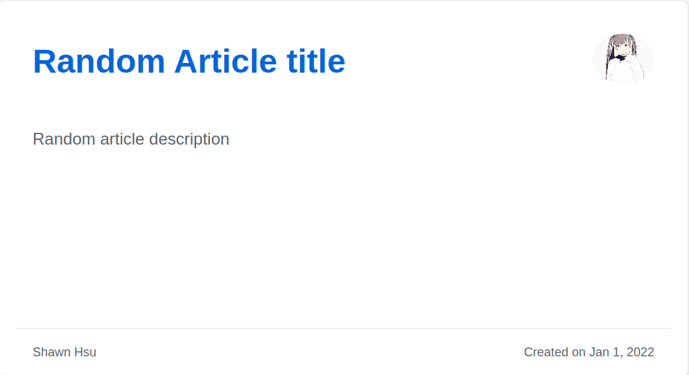

# autogen-og-image
autogen-og-image is a highly customizable [Open Graph](https://ogp.me/) image generator for your blog, specifically for [mmistakes/minimal-mistakes](https://github.com/mmistakes/minimal-mistakes)


## Description


This tool will generate the [Open Graph](https://ogp.me/) image based on the `frontmatter` section in your markdown article

What is a frontmatter?
```
---
title: Random Article Title
description: Random article description
---
```

<hr>

For this tool, the `frontmatter` must have the following attributes

|Required|`title`|`description`|`date`|
|:--:|:--:|:--:|:--:|
|Optional|`author`|`avatar`||

## GitHub Action
Create an action file `.github/workflows/ci.yaml` and fill in following content
```yaml
name: Build and Deploy to Github Pages

on:
  push:
    branches:
      - master # Here source code branch is `master`, it could be other branch

jobs:
  autogen_og_image:
    runs-on: ubuntu-latest
    steps:
      - name: Install puppeteer dependencies
        run: |
          sudo apt-get update
          sudo apt-get install -y libgbm1
      - uses: actions/checkout@v3
      - uses: ambersun1234/autogen-og-image@v1.0.0
        with:
          input_dir: ${{ github.workspace }}/_posts
          output_dir: ${{ github.workspace }}/assets/images/og
          author: 'Shawn Hsu'
      - name: Commit og image and Push
        run: |
          git config --local user.name 'Shawn Hsu'
          git config --local user.email 'ambersun1234@users.noreply.github.com'
          git commit -am "Update og image"
          git push
```

## Environment Variable
This tool also support environment variable as input\
You can find various config in [.env.example](./.env.example)

Just copy to a new file `.env` and make some changes, you're good to go
```shell
$ cp .env.example .env
```

## Run
```shell
$ npm run build
$ node ./dist/main.js
```

## References
+ [A framework for building Open Graph images](https://github.blog/2021-06-22-framework-building-open-graph-images/)
+ [agneym/generate-og-image](https://github.com/agneym/generate-og-image)

## License
This project is licensed under GNU General Public License v3.0 License - see the [LICENSE](./LICENSE) file for detail
